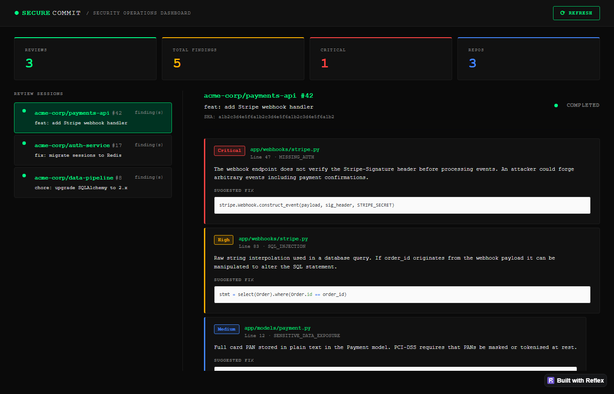
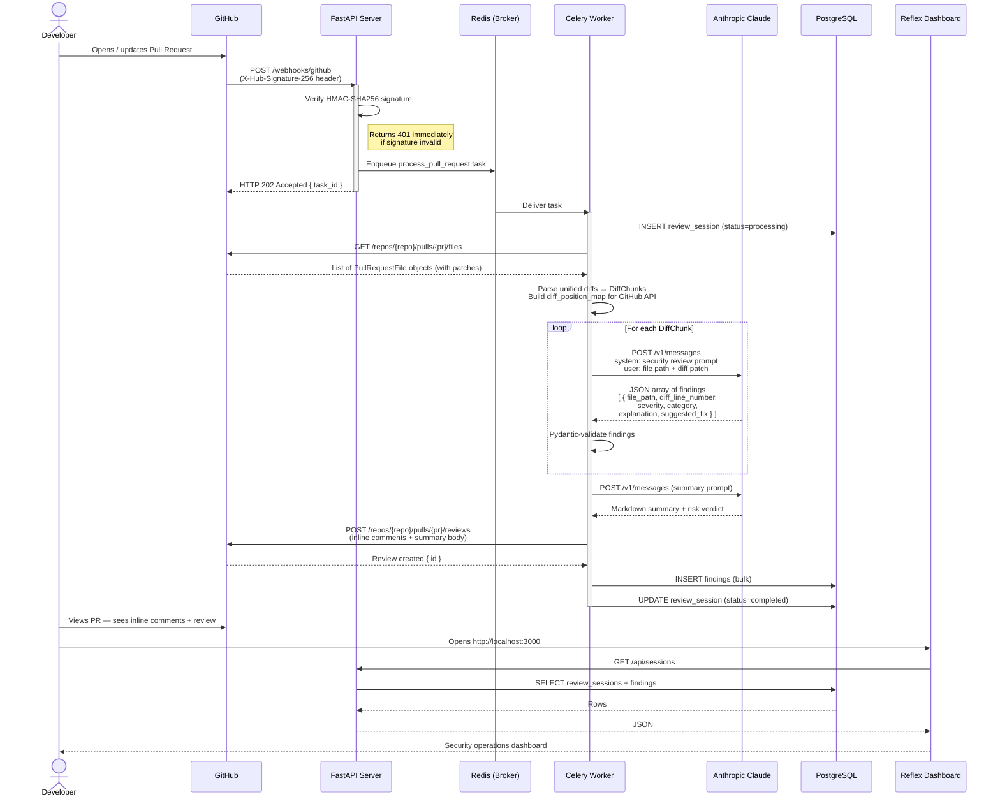

# SecureCommit

> **A GitHub App that automatically reviews pull request diffs for security vulnerabilities using Claude (Anthropic), posts inline review comments on offending lines, and persists all findings to PostgreSQL.**

[](https://github.com/YOUR_USERNAME/securecommit/actions/workflows/ci.yml)
[](https://python.org)
[](https://fastapi.tiangolo.com)



---

## Table of Contents

1. [Overview](#overview)  
2. [Architecture](#architecture)  
3. [Project Structure](#project-structure)  
4. [Component Design Decisions](#component-design-decisions)  
5. [Getting Started](#getting-started)  
6. [GitHub App Setup](#github-app-setup)  
7. [Running Tests](#running-tests)  
8. [Environment Variables](#environment-variables)  
9. [Dashboard](#dashboard)

---

## Overview

When a pull request is opened or updated on a repository that has SecureCommit installed:

1. GitHub sends a `pull_request` webhook to your FastAPI server.
2. The webhook signature is validated via HMAC-SHA256 before any processing.
3. A Celery task is enqueued immediately so the endpoint returns HTTP 202 in milliseconds.
4. The worker fetches the PR diff, parses it into per-file chunks, and sends each chunk to Claude.
5. Claude returns a structured JSON array of security findings (severity, category, file, line, explanation, fix).
6. Findings are posted as inline GitHub review comments on the exact diff lines.
7. A summary review comment is posted with an overall risk verdict.
8. All findings are persisted to PostgreSQL and shown in a Reflex dashboard.

---

## Architecture

### Sequence Diagram



### Service Topology

```
                        ┌─────────────────┐
                        │   GitHub.com    │
                        │  (webhooks)     │
                        └────────┬────────┘
                                 │ POST /webhooks/github
                                 ▼
                        ┌─────────────────┐
                        │   FastAPI :8000 │  ← validates sig, enqueues task
                        └────────┬────────┘
                                 │ task
                    ┌────────────▼────────────┐
                    │     Redis :6379          │  ← broker + result backend
                    └────────────┬────────────┘
                                 │ consume
                        ┌────────▼────────┐
                        │  Celery Worker  │  ← full pipeline
                        └──┬──────────┬──┘
                           │          │
              ┌────────────▼┐       ┌─▼──────────────┐
              │  Anthropic  │       │  GitHub API     │
              │  Claude API │       │  (post review)  │
              └─────────────┘       └─────────────────┘
                                           │
                              ┌────────────▼────────────┐
                              │   PostgreSQL :5432       │
                              │   review_sessions        │
                              │   findings               │
                              └────────────┬────────────┘
                                           │ SELECT
                              ┌────────────▼────────────┐
                              │   Reflex Dashboard :3000 │
                              └─────────────────────────┘
```

---

## Project Structure

```
securecommit/
├── app/
│   ├── main.py                    # FastAPI app factory, lifespan hooks
│   ├── config.py                  # Pydantic-settings, single source of truth
│   ├── prompts.py                 # ALL Claude prompt strings as constants
│   ├── models/
│   │   ├── schemas.py             # Pydantic DTOs: AIFinding, DiffChunk, webhooks
│   │   └── database.py            # SQLAlchemy ORM: ReviewSession, Finding
│   ├── database/
│   │   ├── connection.py          # Async engine, session factory, get_db()
│   │   └── repositories.py        # Data access layer (no raw SQL in services)
│   ├── services/
│   │   ├── diff_parser.py         # Unified diff → DiffChunk, position mapping
│   │   ├── ai_service.py          # Claude API calls, JSON parsing, fallbacks
│   │   └── github_service.py      # PyGithub wrapper: fetch diff, post review
│   ├── tasks/
│   │   └── review_tasks.py        # Celery app + process_pull_request task
│   └── webhooks/
│       ├── validation.py          # HMAC-SHA256 signature verification
│       ├── router.py              # POST /webhooks/github endpoint
│       └── api_router.py          # GET /api/sessions — for dashboard
├── dashboard/
│   └── dashboard.py               # Reflex SPA — security ops terminal aesthetic
├── tests/
│   ├── conftest.py                # Fixtures: settings, mock clients, sample diffs
│   ├── test_validation.py         # Webhook signature verification (9 tests)
│   ├── test_diff_parser.py        # Diff parsing + position mapping (17 tests)
│   ├── test_ai_service.py         # Claude integration + error handling (12 tests)
│   └── test_github_formatting.py  # Comment formatting + webhook router (17 tests)
├── alembic/
│   ├── env.py                     # Migration runner config
│   └── versions/
│       └── 0001_initial.py        # Initial schema migration
├── .github/
│   └── workflows/
│       └── ci.yml                 # pytest on push/PR
├── docker-compose.yml             # api, worker, migrate, postgres, redis, dashboard
├── Dockerfile                     # Multi-stage: base → api | worker | dashboard
├── requirements.txt
├── requirements-dashboard.txt
├── alembic.ini
├── pytest.ini
└── .env.example
```

---

## Component Design Decisions

### Why Celery + Redis instead of FastAPI BackgroundTasks?

`BackgroundTasks` runs in the same process as the web server. A crash, restart, or OOM kill during a review would silently drop the job. Celery tasks are **persisted to Redis** before the HTTP response is sent — if the worker dies, the task is re-delivered. For a security tool, losing reviews is unacceptable.

### Why one `process_pull_request` task instead of a chain?

A Celery chain (fetch → analyse → post → persist) would allow parallel per-file analysis but adds significant complexity: failure at any step requires careful chain-error handling, and partial reviews risk being posted to GitHub. A single task with idempotent steps is simpler, easier to retry as a unit, and correct for the portfolio scope. At production scale, split into a chain with `chord` for parallel analysis.

### Why `hmac.compare_digest` for signature verification?

Standard string equality (`==`) short-circuits on the first differing byte. An attacker sending millions of slightly-different signatures could measure response latency to brute-force the secret. `compare_digest` always iterates the full string in constant time, eliminating the timing side-channel.

### Why post a full `create_review` instead of individual comments?

GitHub's timeline shows one review event instead of N separate comment notifications. Human reviewers submit reviews — so should an automated tool. It also batches the API calls from N+1 to 2 (one review POST + one summary).

### Why parse the diff locally instead of using the GitHub Checks API?

The Checks API requires additional GitHub App permissions and a more complex event flow. For a portfolio project, parsing the patch string that PyGithub already returns is simpler and has zero additional API cost.

### Why per-file diff chunks instead of one big prompt?

1. **Token limits**: a large PR diff can exceed Claude's context window.
2. **Quality**: shorter, focused prompts produce better findings than one enormous context.
3. **Retryability**: a failed analysis for one file doesn't block others.

### Why synchronous SQLAlchemy inside Celery?

Running `asyncio` inside Celery workers requires setting up a new event loop per task (or using `nest_asyncio`), which is fragile and adds complexity. Celery tasks are synchronous Python — using the synchronous psycopg2 driver is the standard, correct approach.

---

## Getting Started

### Prerequisites

- Docker and Docker Compose
- A GitHub account to register the App
- An [Anthropic API key](https://console.anthropic.com/)

### 1. Clone and configure

```bash
git clone https://github.com/YOUR_USERNAME/securecommit.git
cd securecommit
cp .env.example .env
# Edit .env with your real values
```

### 2. Start all services

```bash
docker compose up --build
```

This starts Postgres, Redis, runs Alembic migrations, starts the FastAPI server on `:8000`, a Celery worker, and the Reflex dashboard on `:3000`.

### 3. Expose your local server (development)

GitHub needs a public HTTPS URL to deliver webhooks. Use [ngrok](https://ngrok.com/) or [Cloudflare Tunnel](https://developers.cloudflare.com/cloudflare-one/connections/connect-apps/):

```bash
ngrok http 8000
# Note the https://xxxx.ngrok.io URL — you'll use it in the GitHub App setup
```

---

## GitHub App Setup

### Register the App

1. Go to **GitHub → Settings → Developer settings → GitHub Apps → New GitHub App**
2. Fill in:
   - **GitHub App name**: `SecureCommit` (must be unique on GitHub)
   - **Homepage URL**: `https://YOUR_DOMAIN`
   - **Webhook URL**: `https://YOUR_DOMAIN/webhooks/github`
   - **Webhook secret**: generate a random string, paste it into `.env` as `GITHUB_WEBHOOK_SECRET`
3. **Repository permissions** (read & write):
   - `Pull requests` — Read & Write (to post review comments)
   - `Contents` — Read (to fetch diffs)
4. **Subscribe to events**: ✅ `Pull request`
5. **Where can this GitHub App be installed?**: `Only on this account` for development

### App Manifest (JSON)

You can also create the app programmatically by posting this manifest to `https://github.com/settings/apps/new`:

```json
{
  "name": "SecureCommit",
  "url": "https://YOUR_DOMAIN",
  "hook_attributes": {
    "url": "https://YOUR_DOMAIN/webhooks/github",
    "active": true
  },
  "redirect_url": "https://YOUR_DOMAIN",
  "default_permissions": {
    "pull_requests": "write",
    "contents": "read"
  },
  "default_events": ["pull_request"],
  "public": false,
  "description": "Automated security review for pull requests using Claude AI"
}
```

### Install on a repository

1. From your GitHub App settings page, click **Install App**
2. Select the repositories you want SecureCommit to monitor
3. Open a pull request — SecureCommit will post a review within seconds

---

## Running Tests

Tests are entirely offline — all external services (Anthropic, GitHub, Postgres, Redis) are mocked.

```bash
# Install dependencies locally
pip install -r requirements.txt

# Run all tests
pytest

# Run a specific module
pytest tests/test_validation.py -v

# Run with coverage
pip install pytest-cov
pytest --cov=app --cov-report=term-missing
```

### Test coverage areas

| Module | What's tested |
|---|---|
| `test_validation.py` | HMAC signature: valid, missing, wrong, malformed, tampered body |
| `test_diff_parser.py` | Additions detected, position map correctness, chunk splitting, empty/deletion-only patches |
| `test_ai_service.py` | Happy path parsing, lowercase severity, unknown category, empty response, API error fallback |
| `test_github_formatting.py` | Severity emoji, review event logic, webhook router (202/401/ignored), Celery task enqueue |

---

## Environment Variables

| Variable | Required | Description |
|---|---|---|
| `GITHUB_WEBHOOK_SECRET` | ✅ | Shared secret for HMAC signature verification |
| `GITHUB_TOKEN` | ✅ | PAT or App installation token with `pull_requests:write` |
| `ANTHROPIC_API_KEY` | ✅ | Anthropic API key |
| `DATABASE_URL` | ✅ | Async PostgreSQL URL (`postgresql+asyncpg://...`) |
| `DATABASE_URL_SYNC` | ✅ | Sync PostgreSQL URL for Alembic + Celery (`postgresql+psycopg2://...`) |
| `REDIS_URL` | ✅ | Redis broker URL |
| `CELERY_RESULT_BACKEND` | ✅ | Redis result backend URL |
| `ANTHROPIC_MODEL` | — | Override the Claude model (default: `claude-sonnet-4-20250514`) |
| `MAX_DIFF_LINES_PER_CHUNK` | — | Max diff lines sent to Claude per request (default: `300`) |
| `DEBUG` | — | Enable FastAPI docs and verbose logging (default: `false`) |

---

## Dashboard

The Reflex dashboard runs at `http://localhost:3000` and displays:

- **Stats row**: total reviews, total findings, critical count, repos monitored
- **Session list**: each PR review with status indicator and worst severity badge
- **Detail panel**: all findings for the selected session — severity, category, file, line, explanation, suggested fix in a code block

The terminal-green aesthetic is intentional: this is a security operations tool, not a marketing page.

